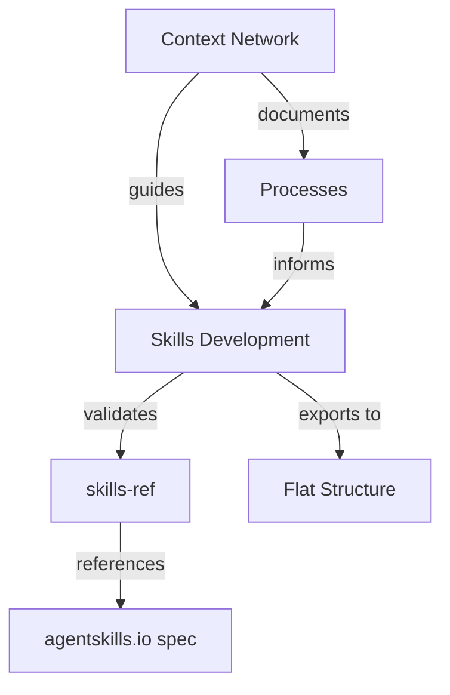

# Project Structure

## Purpose
This document provides an overview of the project structure, including key elements, their relationships, and the principles guiding their design.

## Classification
- **Domain:** Structure
- **Stability:** Semi-stable
- **Abstraction:** Structural
- **Confidence:** Established

## Content

### Structure Overview

This project separates planning/documentation (context network) from deliverables (skills). The context network tracks decisions, processes, and progress, while actual skills are developed in a nested folder structure and exported to flat structure for runtime use.



### Key Elements

#### `skills/` - Nested Development Structure
Contains actual skill deliverables organized hierarchically by domain and category. Each skill is a folder with:
- `SKILL.md` (required) - YAML frontmatter + markdown instructions
- `scripts/` (optional) - Executable code
- `references/` (optional) - Additional documentation
- `assets/` (optional) - Templates, images, data files

Example structure:
```
skills/
├── data-processing/
│   ├── csv/
│   │   └── csv-analyzer/
│   │       └── SKILL.md
│   └── json/
│       └── json-validator/
│           └── SKILL.md
└── web/
    └── scraping/
        └── html-parser/
            └── SKILL.md
```

#### `context-network/` - Planning and Documentation
Contains all planning documents, processes, decisions, and tracking. Does NOT contain actual skills. Organized hierarchically:
- `foundation/` - Core project definition, principles, structure
- `elements/skills/` - Lightweight tracking of each skill's status and decisions
- `processes/` - Creation, validation, and export workflows
- `decisions/` - Key architectural decisions
- `meta/` - Templates and network maintenance docs

#### `reference/agentskills/` - Specification and Validation
Contains the official agentskills.io spec, documentation, and skills-ref validation library. This is source material, not our work product.

#### `CLAUDE.md` / `AGENTS.md` - Collaboration Protocols
Identical files that define how agents should work with the context network. Different agents read different files (Claude Code uses CLAUDE.md, others may use AGENTS.md).

#### `README.md` - Project Overview
High-level introduction to the project, links to key resources, setup instructions.

### Element Interactions

1. **Skill Creation Flow**:
   - Document intent in context network (using planning template)
   - Create skill folder in appropriate `skills/` location
   - Develop SKILL.md and supporting files
   - Validate using skills-ref
   - Update tracking in context network

2. **Export Flow** (future):
   - Read nested skills structure
   - Apply namespace/prefix strategy
   - Generate flat structure
   - Create bundle manifests

3. **Context Network Updates**:
   - Before work: Document what you'll do
   - During work: Record discoveries and decisions
   - After work: Update status and outcomes

### Tools and Methods

| Area | Tools/Methods | Justification |
|-------|--------------|---------------|
| Validation | skills-ref CLI | Official reference implementation for agentskills.io spec |
| Skill Authoring | Markdown + YAML | Simple, portable, human-readable format |
| Organization | Nested folders | Maintainability during development |
| Export | Custom tooling (TBD) | Transform nested to flat while preserving functionality |
| Context Tracking | Context Network | Document-before-action pattern for session resilience |

### Success Criteria

#### Quality
- All skills pass skills-ref validation
- Skills follow progressive disclosure pattern
- Clear, actionable instructions with examples
- Documented in context network

#### Scalability
- Nested structure supports unlimited domains/categories
- Flat export prevents runtime context bloat
- Modular design allows independent skill development
- Bundle manifests enable flexible distribution

#### Maintainability
- Human-readable file organization
- Intent documented before action (session resilience)
- Clear separation: deliverables vs. planning
- Atomic skills with single responsibilities

#### Discoverability
- Hierarchical organization by domain
- Catalog index in context network
- Clear naming conventions
- Well-defined skill descriptions

### Implementation Approach

The project follows these phases:

1. **Template Adjustment** (current): Adapt context network for agent skills
2. **Process Documentation**: Define creation, validation, export workflows
3. **Skill Development**: Create initial skills following documented processes
4. **Export Tool Development**: Build nested-to-flat transformation when needed
5. **Iteration**: Refine processes based on experience

### Future Evolution

- **Export Tooling**: Automated nested-to-flat transformation with namespace management
- **Bundle System**: Manifest-based skill bundling for different use cases
- **Validation Automation**: Pre-commit hooks, CI/CD integration
- **Effectiveness Testing**: Framework for testing skills with live agents
- **Community Patterns**: Library of common patterns and best practices

## Relationships
- **Parent Nodes:** [foundation/project_definition.md]
- **Child Nodes:** 
  - [elements/*/structure.md] - details - Element-specific structural details
  - [decisions/*] - justifies - Key decisions that shaped this structure
- **Related Nodes:** 
  - [foundation/principles.md] - guides - Principles that guided structural decisions
  - [connections/dependencies.md] - details - Dependencies between elements
  - [connections/interfaces.md] - specifies - Interfaces between elements

## Navigation Guidance
- **Access Context:** Use this document when needing to understand the overall project structure and design
- **Common Next Steps:** After reviewing this structure, typically explore specific element structures or decision records
- **Related Tasks:** Project design, element development, integration planning
- **Update Patterns:** This document should be updated when there are significant changes to the project structure or methodology

## Metadata
- **Created:** 2025-12-19
- **Last Updated:** 2025-12-19
- **Updated By:** Claude (via Context Network Template Adjustment)

## Change History
- 2025-12-19: Updated from generic template to agent skills project structure
