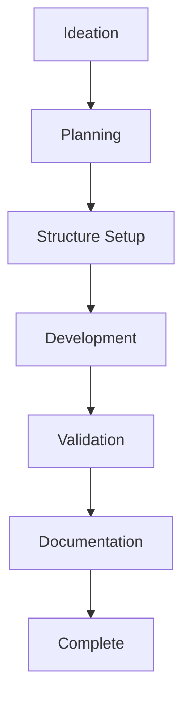

# Skill Creation Process

## Purpose

This document defines the step-by-step process for creating agent skills following the agentskills.io specification.

## Classification
- **Domain:** Process
- **Stability:** Semi-stable
- **Abstraction:** Structural
- **Confidence:** Established

## CRITICAL: Intent-Before-Action

**Before starting ANY step, document your intent in the context network.** This creates a recoverable trail if the session resets. See `workflow-pattern.md` for details.

## Creation Workflow



## Process Steps

### 1. Ideation

**Purpose**: Identify the need for a skill and define its scope.

**Activities**:
- Identify a specific task that agents need help with
- Check if a similar skill already exists (search catalog)
- Define the skill's single, focused purpose
- Verify it aligns with project principles (atomic, spec-compliant)

**Outputs**:
- Clear statement of skill purpose
- Initial thoughts on scope
- Confirmation no duplicate exists

**Tools**:
- `context-network/elements/skills/index.md` - Check existing skills
- `context-network/foundation/principles.md` - Verify alignment

**Document**:
- Note in planning file or decision record why this skill is needed

### 2. Planning

**Purpose**: Create a detailed plan before writing any code.

**Activities**:
- Create planning document in context network
- Define precise scope (what's in/out)
- Choose domain and category location
- Identify structure needs (scripts, references, assets)
- List key decisions to be made
- Consider export name and length
- Identify dependencies

**Outputs**:
- Planning document: `context-network/elements/skills/[domain]/[skill-name]-planning.md`
- Clear understanding of what will be built
- Identified decision points

**Tools**:
- `context-network/meta/templates/skill-planning-template.md` - Use this template
- `reference/agentskills/docs/specification.mdx` - Verify spec requirements

**Document**:
- Use skill planning template
- Get user approval before proceeding

### 3. Structure Setup

**Purpose**: Create the folder structure and initial files.

**Activities**:
- Create skill folder in `skills/[domain]/[category]/[skill-name]/`
- Create SKILL.md with valid frontmatter
- Create subdirectories if needed (`scripts/`, `references/`, `assets/`)
- Create tracking file in context network
- Update catalogs

**Outputs**:
- Skill folder structure created
- SKILL.md with frontmatter (empty body is OK for now)
- Tracking file: `context-network/elements/skills/[domain]/[skill-name].md`
- Updated: `context-network/elements/skills/index.md`
- Updated: `context-network/elements/skills/[domain]/index.md`

**Tools**:
- `context-network/meta/templates/skill-md-starter.md` - SKILL.md template
- `context-network/elements/skills/templates/skill-tracking.md` - Tracking template

**Naming Rules**:
- Folder name MUST match `name` field in SKILL.md frontmatter
- 1-64 characters, lowercase, hyphens only
- No consecutive hyphens, no leading/trailing hyphens

**Document**:
- Update tracking file with status: "in-progress"
- Update catalog indexes

### 4. Development

**Purpose**: Write the skill instructions and supporting files.

**Activities**:
- Write clear, actionable instructions in SKILL.md
- Add concrete examples (input → action → output)
- Document edge cases and error scenarios
- Create scripts if needed
- Create reference docs if needed
- Create assets/templates if needed
- Keep main SKILL.md under 500 lines (recommended)

**Outputs**:
- Complete SKILL.md with:
  - Clear description (what + when)
  - Step-by-step instructions
  - Examples with expected outputs
  - Edge case handling
- Supporting files as needed

**Tools**:
- `reference/agentskills/docs/specification.mdx` - Spec reference
- `context-network/foundation/principles.md` - Progressive disclosure guidance

**Best Practices**:
- Write instructions as if explaining to someone unfamiliar
- Use concrete examples, not abstract descriptions
- Test your own instructions by following them
- Move detailed content to reference files

**Document**:
- Update tracking file as you work
- Record decisions in tracking file
- Note any discoveries or challenges

### 5. Validation

**Purpose**: Ensure the skill meets all requirements and works correctly.

**Activities**:
- Run skills-ref validation
- Fix any spec violations
- Manual testing: follow instructions step-by-step
- Verify name length (consider export prefix)
- Check progressive disclosure (file sizes)
- Review against principles checklist
- Test edge cases

**Outputs**:
- Passing skills-ref validation
- Manually verified instructions
- Updated tracking file with validation results

**Tools**:
```bash
# From reference implementation
cd reference/agentskills/skills-ref
skills-ref validate ../../skills/[domain]/[category]/[skill-name]
```

**Validation Checklist** (also in tracking template):
- [ ] Frontmatter valid (skills-ref)
- [ ] Name follows conventions (lowercase, hyphens, max 64 chars)
- [ ] Name matches folder name
- [ ] Description clear and complete (what + when)
- [ ] Instructions actionable and tested
- [ ] Examples included with expected outputs
- [ ] Edge cases documented
- [ ] Progressive disclosure followed (SKILL.md < 500 lines)
- [ ] Referenced files created if needed
- [ ] Manual testing completed

**Document**:
- Update tracking file with validation date and results
- Record any issues found and how they were fixed
- Update status to "validating"

### 6. Documentation

**Purpose**: Complete all context network documentation.

**Activities**:
- Update tracking file completeness checklist
- Document key decisions made during development
- Update skill catalog indexes
- Note any patterns or learnings
- Verify export considerations documented

**Outputs**:
- Complete tracking file
- Updated catalog indexes
- Decision records if needed
- Noted patterns for future skills

**Tools**:
- `context-network/elements/skills/[domain]/[skill-name].md` - Tracking file
- `context-network/elements/skills/index.md` - Master catalog
- `context-network/elements/skills/[domain]/index.md` - Domain catalog

**Document**:
- All checkboxes in tracking file completed
- Status updated to "complete"
- Catalog indexes reflect new skill

### 7. Complete

**Purpose**: Verify everything is done and documented.

**Final Checklist**:
- [ ] Skill passes skills-ref validation
- [ ] Manual testing completed successfully
- [ ] All examples work as documented
- [ ] Tracking file complete with all metadata
- [ ] Catalog indexes updated
- [ ] Decision records created if needed
- [ ] Export considerations documented
- [ ] Status set to "complete"

**Next Steps**:
- Skill is ready for use
- Can be included in export/bundling
- Patterns can inform future skills

## Common Patterns

### Creating Supporting Files

If your skill needs scripts:
```
skills/[domain]/[category]/[skill-name]/
├── SKILL.md
└── scripts/
    ├── analyze.py
    └── validate.sh
```

Reference them in SKILL.md:
```markdown
Run the analysis script:
```bash
python scripts/analyze.py input.csv
```
```

If your skill needs detailed reference docs:
```
skills/[domain]/[category]/[skill-name]/
├── SKILL.md
└── references/
    ├── REFERENCE.md
    └── api-details.md
```

Reference them in SKILL.md:
```markdown
See [detailed API documentation](references/api-details.md) for complete reference.
```

### Handling Complex Skills

If a skill is becoming too complex:
1. Consider splitting into multiple atomic skills
2. Move detailed content to reference files
3. Keep SKILL.md focused on "how to use"
4. Reference files contain "complete details"

### Decision Points

Pause and document decisions for:
- Domain/category placement
- Naming choices
- Scope boundaries (what's in/out)
- Script language choices
- Reference organization
- Export name strategy

## Quality Standards

- **Spec Compliance**: MUST pass skills-ref validation
- **Clarity**: Instructions must be unambiguous
- **Examples**: Must include concrete examples
- **Testing**: Must be manually tested
- **Documentation**: Must be tracked in context network

## Relationships
- **Parent Nodes:** foundation/principles.md
- **Child Nodes:**
  - processes/validation.md - detailed validation procedures
  - processes/delivery.md - export and delivery
- **Related Nodes:**
  - foundation/structure.md - overall project structure
  - elements/skills/index.md - catalog of skills

## Navigation Guidance
- **Access Context:** Use when creating new skills
- **Common Next Steps:** After creation, see validation.md for detailed validation
- **Related Tasks:** Skill development, specification compliance
- **Update Patterns:** Update when process improvements identified

## Metadata
- **Created:** 2025-12-19
- **Last Updated:** 2025-12-19
- **Updated By:** Claude (via Context Network Template Adjustment)

## Change History
- 2025-12-19: Created agent skills-specific creation process
